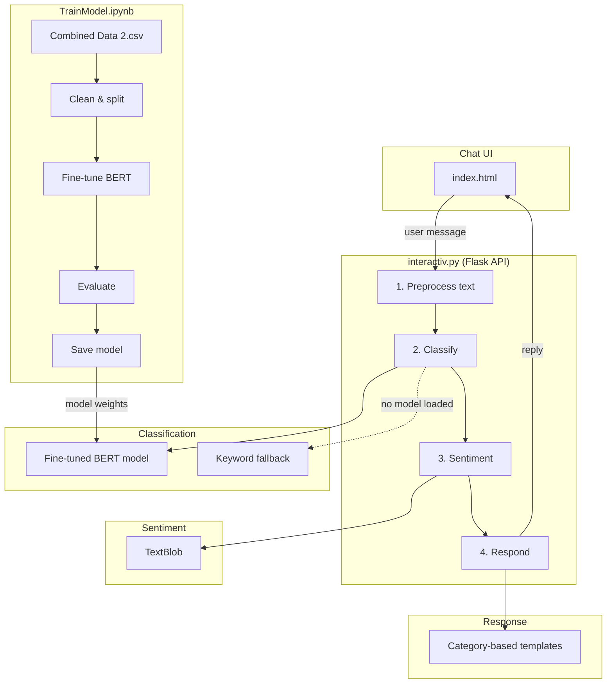

# Lumina

Lumina classifies free-text mental health statements into one of seven labels, runs sentiment analysis, and returns a templated reply. `index.html` posts messages to a Flask endpoint in `interactiv.py`.

**Not a clinical tool.** For experimentation and education only.

## Components

| File | What it does |
|---|---|
| `TrainModel.ipynb` | Fine-tunes [mental-bert-base-uncased](https://huggingface.co/mental/mental-bert-base-uncased) on labeled statements from the dataset |
| `interactiv.py` | Classification, TextBlob sentiment, and template responses behind `POST /analyze` |
| `index.html` | Browser chat UI; fetches `http://localhost:5000/analyze` |
| `dataset/Combined Data 2.csv` | Labeled rows: `statement` column, `status` column, seven categories |

Output labels: anxiety, bipolar, stress, depression, normal, personality disorder, suicidal. The `suicidal` label skips the normal template pool and returns US crisis-line numbers (988, text HOME to 741741).

## Architecture

### Training pipeline

1. Load `dataset/Combined Data 2.csv`; drop rows missing `statement` or `status`.
2. Stratified 80/20 train/eval split (`random_state=42`).
3. Tokenize with mental-bert tokenizer, `max_length=512`.
4. Train 3 epochs via Hugging Face `Trainer` (`per_device_train_batch_size=8`).
5. Print a classification report on the eval set; save weights and tokenizer to disk.

### Inference pipeline

**Classification.** A loaded BERT model returns a label and score. If `./model` is absent, `detect_mental_state()` counts keyword hits from `LABEL_KEYWORDS` and picks the highest count (confidence fixed at 0.5).

**Sentiment.** TextBlob returns polarity (−1 to 1) and subjectivity (0 to 1) on the raw input.

**Response.** `get_response()` draws from category-specific template lists. Confidence above 0.8 on a non-crisis label appends a follow-up prompt; polarity below −0.5 or above 0.5 appends a sentiment note.

## Roadmap

`TrainModel.ipynb` saves to `./monke`; `interactiv.py` loads `./model`. Those paths need to match or the API stays on keyword fallback.

`main.py` prints a stub greeting. `interactiv.py` holds the real server. Entry points and `pyproject.toml` (currently `dependencies = []`) should point at the same install surface as `requirements.txt`.

Replies today come from `np.random.choice()` over static strings in `get_response()`. The next version should pass prior messages and the sentiment dict into reply selection instead of one random pick per category.

`index.html` fires one `fetch` per message with no session ID. Threaded chat needs either server-side session storage or the full transcript bundled in each request body.

The notebook prints eval accuracy and a classification report at train time, but `/analyze` logs nothing at runtime. Add per-category precision/recall on the held-out split and log confidence scores on live requests.

Crisis copy in `interactiv.py` hardcodes 988 and the Crisis Text Line. That list should become a config file so non-US deployments can swap hotlines without editing Python.
