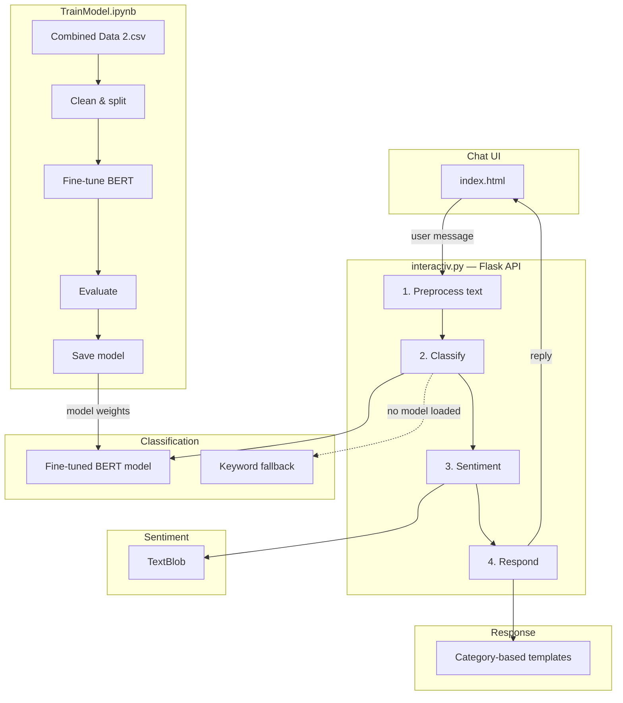

# Lumina

Lumina is a mental health text classifier with a chat interface. You describe how you're feeling; the system predicts a category, reads sentiment, and returns a supportive reply.

**This is not a clinical tool.** It is for experimentation and education only.

## What is built

| Component | Role |
|---|---|
| `TrainModel.ipynb` | Fine-tunes [mental-bert-base-uncased](https://huggingface.co/mental/mental-bert-base-uncased) on labeled mental health statements |
| `interactiv.py` | Inference layer — classification, sentiment analysis, and response generation behind a Flask API |
| `index.html` | Browser chat UI that sends messages to the API and displays replies |
| `dataset/Combined Data 2.csv` | Labeled training data (`statement` → `status`) across seven categories |

The classifier targets seven categories: anxiety, bipolar, stress, depression, normal, personality disorder, and suicidal. Suicidal detections always route to crisis-line resources rather than a casual reply.

## Architecture

### Training pipeline

1. Load and clean `dataset/Combined Data 2.csv`, keeping rows with valid `statement` and `status` values.
2. Stratified 80/20 train/eval split.
3. Tokenize with the mental-bert tokenizer (max length 512).
4. Fine-tune for 3 epochs via Hugging Face `Trainer`, tracking accuracy per epoch.
5. Evaluate with a classification report, then save model weights and tokenizer to disk.

### Inference pipeline

1. **Classification** — a fine-tuned BERT classifier returns a label and confidence score. If no model is loaded, keyword matching against per-category word lists acts as a fallback.
2. **Sentiment** — TextBlob computes polarity (−1 to 1) and subjectivity (0 to 1) on the raw text.
3. **Response** — a template is chosen from category-specific pools. High-confidence non-crisis detections and strong sentiment scores can append follow-up prompts.

## What we're building next

- **Wire up model artifacts** — align the notebook save path (`./monke`) with the API load path (`./model`) so trained weights flow straight into inference.
- **Package the project** — flesh out `pyproject.toml` and consolidate entry points (`main.py` is currently a stub; `interactiv.py` holds the real logic).
- **Improve responses** — move from static random templates toward context-aware replies that factor in sentiment and conversation history.
- **Multi-turn conversation** — the UI is single-message today; next step is session state so the bot can follow a thread rather than treat each input in isolation.
- **Evaluation and monitoring** — track per-category precision/recall on held-out data and log prediction confidence in production to spot drift.
- **Harden crisis handling** — expand suicidal-detection safeguards and make crisis resources configurable by region.
